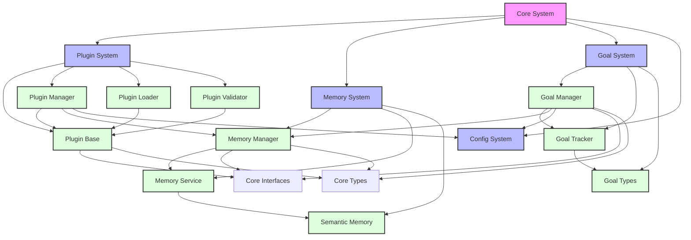

# Panion System Dependency Tree

## Core System Dependencies

## Component Details

### Plugin System
- **Plugin Base**: Base class for all plugins
  - Depends on: Core Interfaces, Core Types
  - Provides: Plugin lifecycle management, security features
- **Plugin Manager**: Manages plugin lifecycle
  - Depends on: Plugin Base, Memory Manager, Config
  - Provides: Plugin registration, initialization, state management
- **Plugin Loader**: Handles plugin discovery and loading
  - Depends on: Plugin Base, Plugin Validator
  - Provides: Dynamic plugin loading, dependency resolution
- **Plugin Validator**: Validates plugin security and compatibility
  - Depends on: Plugin Base
  - Provides: Security checks, compatibility validation

### Memory System
- **Memory Manager**: Manages memory operations
  - Depends on: Core Interfaces, Core Types
  - Provides: Memory storage, retrieval, and management
- **Memory Service**: Handles memory operations
  - Depends on: Memory Manager
  - Provides: Memory access, caching, persistence
- **Semantic Memory**: Manages semantic knowledge
  - Depends on: Memory Service
  - Provides: Semantic search, knowledge representation

### Goal System
- **Goal Manager**: Manages goals and tasks
  - Depends on: Core Interfaces, Core Types, Memory Manager
  - Provides: Goal tracking, task management
- **Goal Tracker**: Tracks goal progress
  - Depends on: Goal Manager
  - Provides: Progress monitoring, state tracking
- **Goal Types**: Defines goal-related types
  - Depends on: Core Types
  - Provides: Type definitions for goals

### Core Dependencies
- **Core Interfaces**: Defines system interfaces
  - Provides: Interface definitions for all components
- **Core Types**: Defines shared types
  - Provides: Type definitions used across the system
- **Config System**: Manages system configuration
  - Provides: Configuration management for all components 